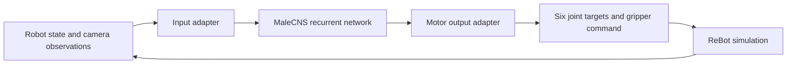

> Historical experiment note. For the current published two-camera controller and model downloads, start with [README.md](README.md) and [training.md](docs/training.md). Referenced local reports/data are not all included in the public release.

# MaleCNS robot-arm control: implementation and training plan

> Implementation update (2026-09-09): this is the historical design plan. The implemented shared root is `$HOME/code/data/malecns`, replacing the proposed `~/Models` layout below. See `README.md` for current commands and `IMPLEMENTATION_REPORT.md` for measured results. Software and initial experiments are delivered; autonomous pickup is not yet qualified.

Prepared 2026-09-09. Status: proposed work, not an implemented or trained neural controller. Only public download headers were fetched; no connectome tables or model weights were downloaded.

Code project: `$HOME/code/codex/fly-brain`.
Simulator: `$HOME/github/rebot-motion-lab-codex`, using MCP server `rebot-motion-lab-codex`.

## Recommended approach

Build a reusable recurrent neural controller whose internal connections come from MaleCNS. Train input and output adapters around that graph, first using successful robot demonstrations. Add feedback-driven corrections and, only if useful, reinforcement learning. Begin with exact simulator state, then replace object-state inputs with camera-derived observations.

MaleCNS supplies anatomy. We supply the neuron-update equations, sensory interface, action decoder, and learned parameters. A successful robot policy would demonstrate useful computation through the measured wiring; biological fidelity and an advantage over ordinary neural networks require separate evidence.

FlyGM is relevant methodological precedent for imitation followed by reinforcement learning with connectome-structured control, but its reported tasks concern a simulated fly. Its project page currently labels its code as coming soon, so it is a research reference rather than a ready ReBot dependency. [Paper](https://arxiv.org/abs/2602.17997), [project page](https://lnsgroup.cc/research/FlyGM/).

## 1. Controller architecture



**First model:** a leaky, continuous-valued neural network over the full identified MaleCNS neuronal graph. Keep the connectivity operator fixed. Begin with one state value per neuron; benchmark four channels only after the first version works. Use one to four graph updates per control decision as an experimental setting. These updates are abstract controller steps, not a claim about elapsed biological milliseconds.

Use normalized synapse counts for the initial graph operator and retain neurotransmitter predictions as neuron features. Trainable input projections, output decoding, and shared neuron-response parameters supply the robot adaptation. A separate signed/spiking variant can later introduce explicitly documented physiological assumptions. Neurotransmitter labels alone should not be treated as a complete set of electrical parameters.

Choose input populations from annotated sensory/afferent cells and output populations from suitable descending/motor cells after inspecting the actual MaleCNS schema. Pin the selected IDs and mapping. Robot features assigned to these populations are engineered interfaces, not experimentally established fly-to-robot correspondences. Validate that the input and output populations are connected and disjoint.

The output head reads pooled output-neuron activity and predicts six bounded joint increments plus an open/close gripper command. A thin adapter converts increments to the simulator's absolute joint targets. All task-dependent control should pass through the graph; do not add an observation-to-action shortcut that can solve the task independently.

Start at **5 control decisions/second** as a target, subject to profiling. Preserve the simulator's joint bounds, floor checks, rate limits, episode/frame checks, and two-second controller lease. Load weights, initialize the graph, and warm up inference before acquiring control. Each episode gets independent neural state.

The original [Shiu brain model](https://github.com/philshiu/Drosophila_brain_model) offers an MIT-licensed Brian2 reference for later spiking experiments. It uses FlyWire data, so its neuron IDs and data files cannot simply be substituted for MaleCNS. Keep a spiking reference experiment separate from the initial learned rate-model policy.

## 2. Required downloads

Download these three official files. Sizes below are exact HTTP `Content-Length` values observed on 2026-09-09; the companion `downloads.manifest.json` records URLs, object generations, and transport checksums.

| Asset | File | Bytes |
| --- | --- | ---: |
| Weighted connectivity | `connectome-weights-male-cns-v1.0-minconf-0.5.feather` | 1,051,241,946 |
| Neuron annotations | `body-annotations-male-cns-v1.0-minconf-0.5.feather` | 14,483,314 |
| Transmitter predictions | `body-neurotransmitters-male-cns-v1.0.feather` | 43,282,834 |

Total: **1,109,008,094 bytes: 1.109 GB, or 1.033 GiB**. These are datasets, not a pretrained arm-control checkpoint. The official download page documents the tables and their purpose. [MaleCNS downloads](https://male-cns.janelia.org/download/).

Microscopy volumes, neuron meshes, skeletons, and individual synapse-coordinate tables are unnecessary for the first controller. The graph and annotations are enough to begin.

No pretrained vision or language model is required initially. For the camera phase, first try a small detector/encoder trained on our simulator images or an explicit orange-cube detector. If a pretrained encoder improves results, a frozen **ResNet-18 ImageNet checkpoint** is a modest optional starting point, documented at approximately 44.7 MB. It still needs adaptation to this task. [Torchvision ResNet-18](https://docs.pytorch.org/vision/stable/models/generated/torchvision.models.resnet18.html).

MaleCNS is published under CC BY 4.0. Keep its attribution, license link, and descriptions of our transformations with shared and exported artifacts. [Dataset license information](https://male-cns.janelia.org/download/), [CC BY 4.0](https://creativecommons.org/licenses/by/4.0/).

## 3. Shared storage across projects

Use a durable shared root outside every repository. Proposed new root: **`$HOME/Models`**. This directory has not been created by this planning task.

```text
$HOME/Models/
  connectomes/
    malecns/v1.0/
      raw/                         # original three files, immutable
      derived/<recipe-hash>/       # reusable sparse graph and ID mappings
        graph-csr.npz
        node-ids.npy
        neuron-features.parquet
        io-populations.json
        manifest.json
        ATTRIBUTION.md
  checkpoints/
    malecns-core/<architecture>/<run-id>/
    rebot-b601dm/pick-hold/<run-id>/
    rebot-b601dm/pick-hold-release/<run-id>/
  datasets/
    rebot-pick/<dataset-version>/
  torch/                           # optional Torchvision/Hub downloads
```

The existing **`$HOME/.cache/huggingface/hub`** should remain the shared cache for Hugging Face models. Cache directories for CLIP variants exist, but their completeness and suitability have not been verified. Inspect existing snapshots before considering a new download.

Set cache paths in project launch configuration, before importing the relevant libraries:

```sh
export NEURO_ASSETS_HOME="$HOME/Models"
export HF_HUB_CACHE="$HOME/.cache/huggingface/hub"
export TORCH_HOME="$NEURO_ASSETS_HOME/torch"
```

Hugging Face and PyTorch document these cache controls. Keep existing Hugging Face authentication settings in place; a portable asset bundle should contain model/data files, not the account's credential store. [HF cache variables](https://huggingface.co/docs/huggingface_hub/en/package_reference/environment_variables), [PyTorch Hub cache](https://docs.pytorch.org/docs/2.14/hub.html#where-are-my-downloaded-models-saved).

Implement the asset resolver with these rules:

- Download once using a per-asset lock and a temporary `.partial` file. Check recorded length, object generation, and available checksum; compute SHA-256 after the full download. Do not pretend the header ETag is a SHA-256 digest.
- Reuse a matching cached asset. If source metadata changes, resolve it as a new version rather than silently overwriting the pinned data.
- Derive graph-cache paths from source hashes plus the import/normalization recipe and code version.
- Keep raw graphs and shared checkpoints immutable. Fine-tuning writes a new run directory.
- Store only small configuration and asset IDs in Git. Code environments remain project-specific; large data and model files are shared.
- Save learned dense weights in a portable format such as safetensors, graph arrays separately, and all normalization, schema, and architecture details in JSON. Store optimizer state separately for resuming our own training.
- Checkpoints reference the shared graph by hash instead of embedding another graph copy in every checkpoint. Export tools may bundle the referenced files once when moving to another machine.

A different project can reuse the connectome, graph cache, optional vision weights, and compatible learned core. A different robot generally needs new observation/action adapters and validation. Sharing an artifact does not imply zero-shot transfer of the ReBot controller.

## 4. Import and validate the connectome

Use Python, PyArrow, NumPy/SciPy, and PyTorch. Pin tested dependency versions when implementing; no new environment was installed for this plan.

Import the official tables and retain the identified neuronal set and its internal connections. Audit raw segment/fragments separately. Establish the actual neuron/edge counts from the imported data; roughly 166,700 neurons is a reference target, not an excuse to force the data into a predetermined count.

Preserve integer body IDs and build one stable contiguous index. Preserve directed edges, original contact counts, annotations, and transmitter confidence. Record every exclusion. Multiple synaptic contacts between the same neurons form a weighted edge; do not expand each contact into a separate matrix entry unnecessarily.

Build sparse CSR/COO operators, audit direction with a tiny known graph, and test gradients on a small fixture before full-size training. PyTorch documents sparse/dense multiplication and its gradient support; backend support must be tested on the pinned installation. [Sparse multiplication](https://docs.pytorch.org/docs/2.14/generated/torch.sparse.mm.html).

Never construct a full dense adjacency matrix. At 166,700 neurons, one dense float32 matrix alone would occupy approximately **103.5 GiB**. A graph with approximately 25.6 million weighted edges can instead use roughly 0.2–0.3 GB for basic CSR arrays, depending on index width. That edge count is an estimate from comparable imports; our importer must measure it. Runtime, gradients, activations, and metadata require additional memory.

**Gate:** audited provenance and counts; correct sparse propagation; no accidental dense allocation; finite, input-responsive neural activity; independent episode reset; measured memory and latency on the actual full graph.

## 5. Prepare a reliable teacher and dataset

The simulator already supports the necessary motion, state, image, and recording interfaces. A few collection/runner improvements are still needed:

1. **Adapt grasp approach to size.** The current teacher targets the cube center with a grasp frame 20 mm behind the fingertips. For a 10 mm cube, this puts a top-down tool target below the floor. Start with the proven 50 mm cube, then validate size-aware approaches before admitting smaller cubes. The 90 mm boundary also leaves no opening margin for approach error.
2. **Define an admissible training region.** The arm cannot reach the whole 4 m floor. Validate candidate grasp and lift paths before labelling them solvable. Keep unreachable placements as a separate rejection/abstention test set.
3. **Collect images at the policy rate.** The current conventional collector requests images around 2 Hz. For a 5 Hz camera policy, collect a synchronized observation and action label at each 200 ms decision point.
4. **Record intent and execution separately.** Preserve requested gripper close commands even when the actual aperture stops against the cube. A 50 mm observed aperture is not an instruction to loosen the grasp. For joints, use timestamp-aligned local targets/increments, not an unexamined stream of repeated distant waypoint targets.
5. **Handle release explicitly.** The existing policy runner exits when the hold phase completes. For learned release, extend the episode runner and scorer to allow a bounded post-hold phase, keep invoking the neural policy, and require opening/drop only after a successful hold. Retain the original hold result and separately score release.
6. **Export recordings to shared durable storage.** Simulator recordings originate in a private temporary directory. Copy and validate completed episodes promptly. Store metadata in Parquet/JSON and compressed images as files; avoid duplicating base64 images across derived datasets.

First collect a **50-episode pilot** with a 50 mm cube, several verified positions, and small yaw changes. Record successful trajectories and failed attempts with reasons. Validate the teacher on a separate placement set before scaling collection.

Then collect approximately **500–1,000 demonstrations**, adjusting that target based on learning curves. Split complete episodes and placement/size combinations into training, validation, and held-out test sets. Do not randomly split neighbouring video frames across those sets.

Use only admissible combinations for the pickup success denominator. Test unsupported placements separately, with correct rejection or safe inactivity as the desired outcome. Start with 50 mm, expand to a teacher-validated middle range, then work toward the 10–90 mm limits where geometry allows.

## 6. Train in stages

### A. State-based imitation learning

Use declared state observations: joints/velocities, aperture, tool pose, cube pose or relative cube-to-tool position, and the goal. Normalize inputs using training data only. Exclude episode IDs, future observations, expert actions, evaluator success counters, and other metadata from policy features.

First test a frozen graph reservoir with fixed input mapping and a trained output head. This is a cheap information-flow diagnostic; poor performance is a reason to improve the model, not to assert that the connectome is incapable of control.

Next train the input adapter, output adapter, and shared neuron-update parameters while keeping the anatomical graph fixed. Use behaviour cloning with a regression loss for bounded joint actions and a classification loss for gripper intent. Balance approach, grasp, lift, hold, and release samples so long idle/hold periods do not dominate training.

Train on sequences, resetting hidden state only at episode boundaries. Use burn-in and truncated backpropagation as needed; maintain enough history for the five-second hold. Candidate sequence lengths of 32–64 steps at 5 Hz are starting settings, subject to profiling. Cache pooled features when useful; storing every neuron's state for every training frame can exhaust disk space rapidly.

**Gate:** closed-loop pickup/hold on new placements, not merely low loss on recorded actions. Proposed promotion target: at least 90 successes in 100 held-out admissible trials, with confidence intervals and repeated training seeds. This is a target, not a predicted result.

### B. Correct mistakes with dataset aggregation

Let the learned policy drive the simulator, ask the conventional teacher for corrective action labels on the states the policy actually visits, add those sequences, and retrain. Keep teacher-assisted collection distinct from autonomous evaluation. This addresses the distribution shift caused by the policy's own errors. [DAgger paper](https://arxiv.org/abs/1011.0686).

### C. Introduce vision

Replace exact cube-state inputs with features computed from the front/top RGB observations. Start with explicit colour/shape features or a small supervised CNN trained using simulator pose labels. Exact pose is allowed as a training label; it must not enter camera-only inference.

Supply missing/occluded detection flags and temporal history. Check whether the smallest cubes contain enough pixels at the current 320×240 resolution. If they do not, add a calibrated higher-resolution or closer observation view before collecting a large dataset. Revalidate camera geometry whenever it changes.

Only add optional pretrained vision weights if they improve a measured failure. Keep the resulting vision encoder separate from the graph and robot head, and resolve any downloaded weights through the shared cache.

### D. Optional reinforcement learning

After a competent imitation policy exists, use a recurrent PPO-style fine-tuning loop. Possible reward terms are progress toward a valid grasp, stable bilateral contact, cube clearance, level holding, and correct release. Penalize collisions, drops before the goal, excessive action changes, and timeout. Use an independent evaluation criterion to detect reward exploitation.

The actor receives only declared policy observations. A training critic may use privileged simulator state if this asymmetry is explicit. Preserve neural history, action probabilities, termination masks, and time alignment when collecting recurrent rollouts.

Keep graph edges/counts fixed initially. If additional flexibility is justified, introduce constrained cell-type gains or response parameters first. Any later edge-weight adaptation must retain the anatomical mask and receive its own model/recipe version.

## 7. Compute and time expectations

Verified local hardware: **Apple M2 Max, 96 GB memory**. Approximately **182 GiB free disk space** was reported during planning. These are snapshots, not performance benchmarks.

Start with sparse CPU execution for the graph and benchmark the exact forward/backward operations. MPS availability does not establish that every sparse operator is supported or fast. Dense vision work may benefit from MPS independently. If needed, train offline on a CUDA machine using shared datasets and return checkpoints to the Mac; this does not accelerate the Mac's physical simulation.

Target full-loop p95 latency below 200 ms for the initial 5 Hz policy, with margin below the two-second lease. If the full graph misses the target, first reduce channels/update count or optimize the kernel. A reduced circuit is a separately labelled experiment, not a silent substitute for the full graph.

RealityKit currently provides one real-time environment without fixed-step or batch execution. At an illustrative 15–30 seconds per demonstration, 500–1,000 episodes require roughly **2.1–8.3 hours of simulation alone**. At 5 decisions/second, one million online RL decisions require approximately **55.6 hours** before resets and training overhead. These are arithmetic estimates, not wall-clock promises.

If substantial online RL becomes worthwhile, add a tested stepping/batch backend or a separate MuJoCo training environment. A port must reproduce geometry, grasp/contact assumptions, units, and action semantics, then be checked back in RealityKit for simulator-to-simulator differences. It is a later infrastructure project, not a capability the current app already has.

Reserve approximately 5–10 GB for initial raw/derived assets and a bounded 10–20 GB pilot dataset/checkpoint budget. Measure compressed episode size before expanding collection. Keep only selected checkpoints and store graph references rather than repeated graph copies.

## 8. Establish the connectome's contribution

Evaluate the same observation/action adapters and data splits with:

- The original MaleCNS graph.
- A degree-preserving rewired graph with comparable weight statistics.
- A conventional recurrent network baseline with comparable trainable capacity.
- Disconnected inputs or disabled graph propagation as dependency checks.

Keep evaluation seeds, admissible tasks, and training budgets comparable; report both environment samples and compute time. Show success, drops, tilt/height errors, latency, and data efficiency across several trained seeds. A disabled graph test establishes reliance on the graph path; it does not by itself establish that fly topology is better than another topology.

For final autonomous evaluation, remove teacher guidance and inspect unseen placements, sizes, starts, and modest visual changes. Freeze the checkpoint and publish the exact observation/graph/action specifications alongside the results.

## 9. Implementation deliverables and order

| Milestone | Deliverable | Completion evidence |
| --- | --- | --- |
| 1 | Shared asset resolver, verified downloads, graph importer | A second project loads the same cached graph without downloading it again |
| 2 | Full-graph inference and reference checks | Counts/provenance, numerical checks, memory use, latency report |
| 3 | Size-aware teacher, aligned collector, durable dataset export | Validated pilot and episode-level splits |
| 4 | State-based behaviour-cloning policy | Closed-loop held-out pickup/hold results and baseline comparisons |
| 5 | Dataset aggregation and vision encoder | Autonomous camera-based performance with input isolation |
| 6 | Optional RL and full pick-hold-release | Separate hold/release metrics and an independently tested checkpoint |

Suggested code modules in this project: `assets`, `connectome`, `neural_core`, `observation_adapter`, `action_adapter`, `dataset`, `train_bc`, `train_rl`, `evaluate`, and a policy factory implementing the simulator runner's `reset()` / `act()` contract.

Each released model package should contain a model card, graph/recipe hash, input and action schemas, normalization, encoder/core/head weights, dataset split identifiers, simulator commit and physics settings, provenance/licensing, benchmark results, and a minimal inference example. Reusing it in another project should require selecting an asset ID and compatible adapter—not copying a repository's private paths or downloading the same weights again.
