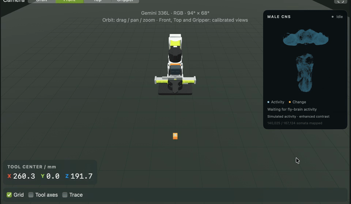
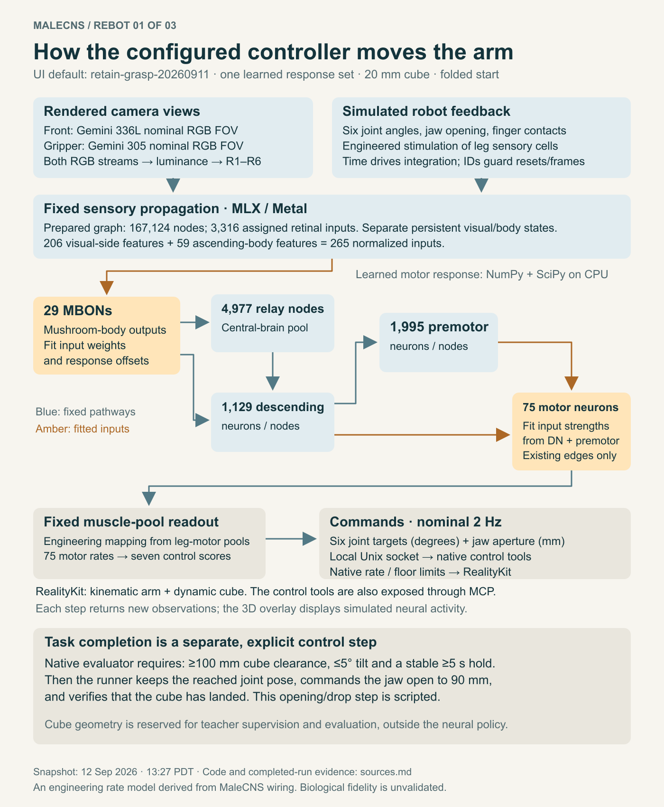
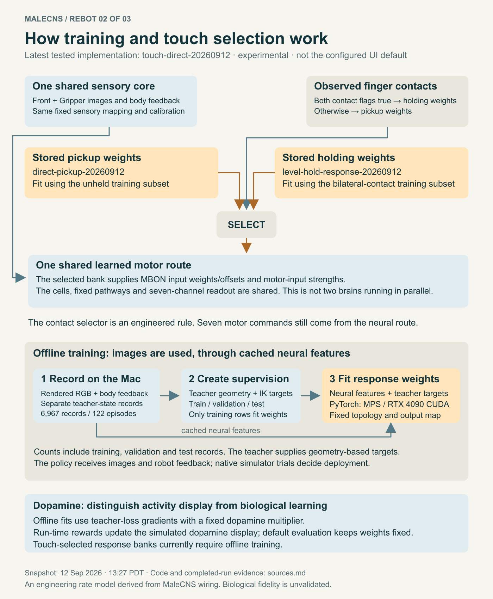
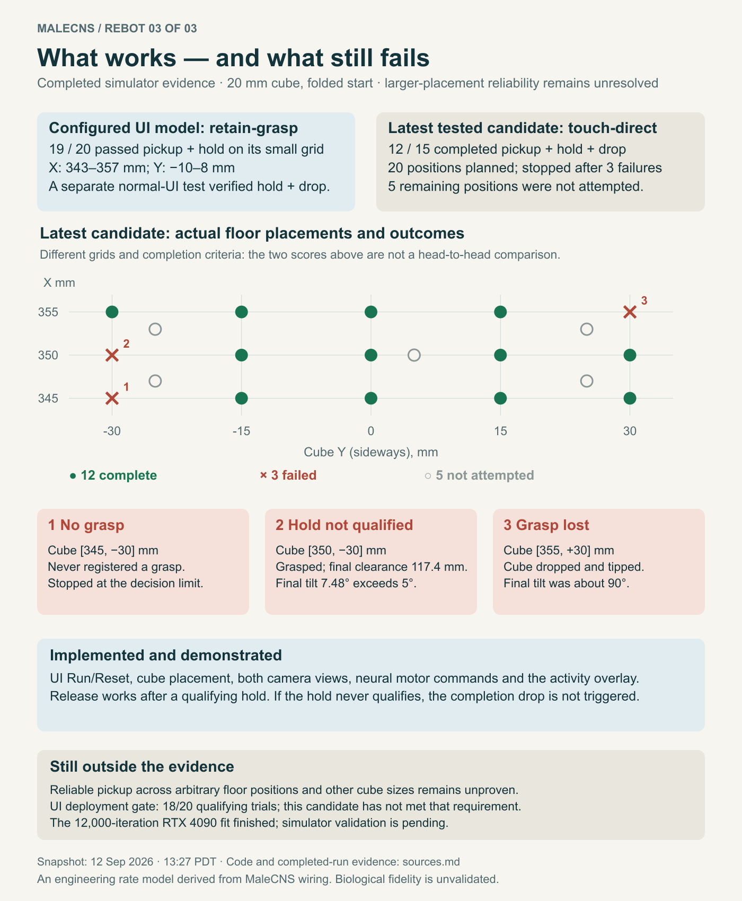

# Fly Brain Codex

A MaleCNS-derived neural controller for a simulated six-joint robot arm and gripper. Two rendered cameras and robot feedback drive an experimental connectome-based network that can pick up a 20 mm cube, lift it and hold it level. A scripted completion routine then releases the cube and verifies its landing.

**An anatomical wiring map became an engineered controller. This is not a pretrained fly brain, a biologically validated simulation, or a generally reliable robot policy.**

[Download models on Hugging Face](https://huggingface.co/monomyth/fly-brain-codex) · [Native simulator branch](https://github.com/monomyth/rebot-motion-lab/tree/fly-brain-codex) · [Results and limits](docs/results.md)



[Watch the recorded run](docs/media/pickup-hold-drop.mp4). This is one selected successful trial; it is not a success-rate summary.

## What works today

| Controller | Evidence | Scope |
|---|---|---|
| Retained UI baseline (`stable`) | 19/20 pickup-and-hold trials; separate real UI pickup/hold/drop checks passed | 20 mm cube, folded start, small region X343–357 / Y−10–8 mm |
| Newer touch-gated controller (`experimental`) | 12/15 complete pickup/hold/drop tasks; 20 planned and 5 unrun | Broader positions; not qualified for default UI deployment |
| Latest RTX 4090 continuation | 12,000 optimizer iterations completed | Fit results only; no native closed-loop qualification |

Moving the cube farther sideways can still cause missed grasps, dropped grasps or excessive tilt. Other cube sizes and arbitrary floor placement are simulator features, not established controller skills. “Stable” means the retained baseline, not production reliability.

## Run on an Apple Silicon Mac

Python 3.13 and Xcode command-line tools are required. The tested runtime used Apple M2 Max, MLX 0.32.2 and native RealityKit. Keep the display awake/unlocked during simulation. Linux/CUDA can fit the learned head, but does not run this macOS simulator.

Clone into these local directory names; the simulator uses these defaults:

```sh
mkdir -p ~/code/codex ~/github
git clone https://github.com/monomyth/fly-brain-codex.git ~/code/codex/fly-brain
git clone --branch fly-brain-codex https://github.com/monomyth/rebot-motion-lab.git ~/github/rebot-motion-lab-codex
cd ~/code/codex/fly-brain
python3.13 -m venv .venv
.venv/bin/python -m pip install -e '.[ui,test]'
python3 scripts/download_model.py
.venv/bin/python scripts/run_mlx_ui.py --check-deployment
cd ~/github/rebot-motion-lab-codex
bash scripts/swift-local.sh test
bash scripts/build-app.sh ./dist
open 'dist/ReBot Motion Lab Codex.app'
```

If those directories already contain your work, reuse the matching checkouts instead of cloning over them. The public model download is about 355 MB for the baseline and shared runtime assets; no Hugging Face token is needed. Numerical arrays retain their original SHA-256 hashes. The installer preserves differing existing assets and creates a separate `hub-stable-2026-09-12` checkpoint. It relocates historical evidence addresses; it does not perform a new hardware qualification.

In the UI, use **Set up cube → Run fly brain**, with **Learn from reward unchecked**. Start folded, keep the cube at X350 / Y0 mm, and use 20 mm size. After a successful five-second hold, the completion routine opens the fingers and checks the drop. **Reset → Apply cube** prepares another trial. **Results…** opens the measurements and both camera recordings. See [UI instructions](RUN_UI.md).

## What is trained



1. Fixed Front and wrist-mounted Gripper RGB renders become luminance input to assigned retinal populations. Camera models use nominal Orbbec Gemini 336L and 305 RGB fields of view; they do not simulate depth or factory lens distortion.
2. Joint angles, gripper aperture and finger contacts stimulate an engineered body-sensory encoding. The actor does not receive cube XYZ, task phase or inverse-kinematics targets.
3. A persistent, fixed sensory network derived from MaleCNS wiring runs on MLX/Metal. A learned motor head runs on CPU and produces six joint targets plus aperture at a nominal 2 Hz.
4. Demonstrations and task-space objectives train selected existing signed connections and response offsets with PyTorch MPS/CUDA. The motor-pool-to-robot mapping is engineered. A fixed dopamine multiplier in offline fitting is not evidence of biological reward learning.
5. Native actuators and floor constraints execute the targets. The evaluator checks at least 100 mm clearance and at most 5° tilt for five seconds. Successful completion triggers an explicit scripted release.



The experimental controller selects pickup or holding parameter banks from bilateral finger contact. That selector is engineered. Training loss improvements are not evidence of improved closed-loop success.

## Data, models and reproduction

Model binaries and derived graphs live on [Hugging Face](https://huggingface.co/monomyth/fly-brain-codex); source, tests and lightweight previews live here. The release includes frozen training features/targets and provenance, not the full historical RGB dataset.

```sh
# Download the newer research controller without changing the UI default:
python3 scripts/download_model.py --profile experimental

# Run source tests:
.venv/bin/python -m pytest -q
```

See [training and reproduction](docs/training.md) for the pipeline and its boundaries. Original reference downloads can be shared at `~/code/data/malecns/v1.0`; all generated datasets, models, caches and reports belong under this project's `data/` or `reports/`. Other projects can reuse the versioned runtime artifacts without downloading duplicate copies.

## Evidence and project history



[Results and limitations](docs/results.md) · [Infographic sources](docs/infographics/sources.md) · [Effort estimate](docs/effort-estimate.md) · [Camera geometry](CAMERA_VIEWS.md) · [Motor mapping](MOTOR_NEURON_MAP.md)

Research notes at the repository root and experiment-specific scripts preserve earlier iterations. They may reference local datasets or superseded controllers. Use this README and `docs/` for the current release; do not treat historical state-based training instructions as the deployed two-camera pipeline.

## Attribution

Code: [MIT](LICENSE). Published derived model/graph artifacts: CC BY 4.0. MaleCNS is work by FlyEM at HHMI Janelia, University of Cambridge, MRC Laboratory of Molecular Biology, Google Research and collaborators. See [original downloads](https://male-cns.janelia.org/download/) and [third-party notices](THIRD_PARTY_NOTICES.md). This independent experiment is not endorsed by those organizations or the camera/robot vendors.
